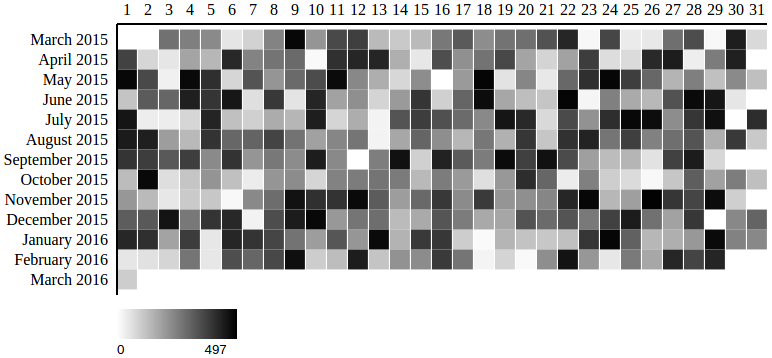
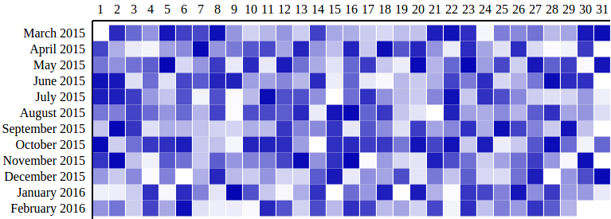
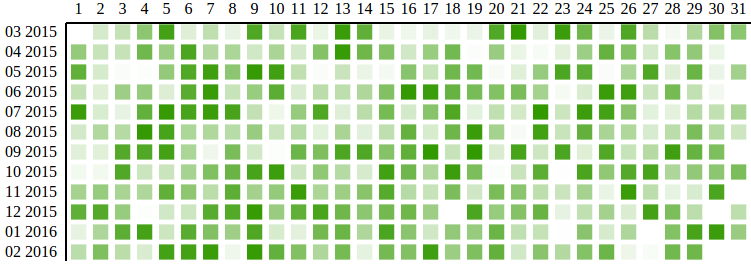

# D3 Object Charts
D3 visualization components implemented as objects. Available charts:
* Calendar grid chart
* Spline stack chart
* Composite bar / line chart

## Installing
-------------
Make sure the following packages are installed on your machine
* node.js
* npm

### Install dependencies
```
$ npm install
```

### Minified production build
Compile into a minified bundle with external stylesheets.
```
$ gulp build
```

## Usage

After the installation of the dependencies the required chart can be instantiated in [src/main.js](src/main.js).

Upon completion it has to be compiled using:
```
$ gulp build
```

The compiled JS and CSS files can now be referenced to from within an HTML file.
```
// Minified stylesheets
<link href="dist/style.min.css" rel="stylesheet" type="text/css">

// Minified bundle containing D3 and chart implementation
<script charset="utf-8" src="dist/bundle.js"></script>
```

## API reference
### Calendar grid chart
Grid chart showing one month per row. Displays the y values in different opacities of a color tone. Higher values equal a darker color.

#### Example


This example depicts a calendar grid chart created with the required options [using this example data set](docs/datasets/example_one.js).

```js
var calendar = new CalendarGridChart({
  container: '#container-calendar',
});
calendar.drawData({
  values: data
});

```

#### Options: object instantiation

The following list shows all available options that can be passed to the CalendarGridChart object during the instantiation.

```js
var calendar = new CalendarGridChart({
  container: '#container-calendar',
  // optional properties:
  date_attr: 'date',
  // ...
});

```
Properties marked in `this format` are required.


| property | description |
| -------- | ----------- |
| `container`  | The selector representing the parent element in which the SVG will be created.  |
| *date_attr*  | The identifier for the x scale property within the data objects. Defaults to 'date'. |
| *range_attr*  | The identifier for the x scale property within the data objects. Defaults to 'date'. |
| *outer_width*  | The initial width of the SVG that contains the chart. Defaults to 800px. |
| *outer_height* | The initial height of the SVG that contains the chart. Defaults to 360px. |
| *margin* | The margin defines the space of the four sides around the chart. Defaults to *{top: 30, left: 150, bottom: 30, right: 0}* |
| *color_min* | The brightest color rendered for the lowest value of the range. Defaults to #fff |
| *color_max* | The darkest color rendered for the highest value of the range. Defaults to #000 |
| *grid_padding* | The amount of space in the range interval to be allocated to padding. Typically in the range [0,1]. Defaults to 0.05. |
| *display_date_format* | The format of the Y axis ticks. Defaults to %B %Y (Month Year). |
| *min_range_zero* | Sets the minimum value of the range to 0. Defaults to false. |
| *legend* | Shows a legend with the color range that is used from the minimum value to the maximum value. Defaults to true. |

#### Options: drawData method call

The following list shows all available options that can be passed to the drawData method call.

```js
// previously created variable is referenced
calendar.drawData({
  css_class: "production-value",
  // optional property:
  values: data
});

```
Properties marked in `this format` are required.

| property | description |
| -------- | ----------- |
| `values`  | The array containing the data for the chart. Can refer to a variable or the objects can be inserted inline. |
| *css_class* | The CSS class identifying each *rect* element in the data set. Defaults to *none*. |

## Examples

This example depicts a calendar grid chart created with additional non-default options and [this example data set.](docs/datasets/example_two.babel.js)



```js
var calendar1 = new CalendarGridChart({
  container: '#container-calendar1',
  date_attr: 'day_date',
  range_attr: 'production',
  outer_width: 800,
  outer_height: 400,
  color_max: '#0404B4'
});

calendar1.drawData({
  css_class: "prod-value",
  values: data1
});

```

---

This example depicts a calendar grid chart created with additional non-default options and [this example data set.](docs/datasets/example_three.js)



```js
var calendar2 = new CalendarGridChart({
  container: '#container-calendar2',
  grid_padding: 0.3,
  margin: {
    top: 50,
    left: 115,
    bottom: 50,
    right: 0
  },
  display_date_format: '%m %Y',
  date_attr: 'date',
  min_range_zero: true,
  range_attr: 'value',
  color_max: '#339900',
  legend: false
});

calendar2.drawData({
  css_class: "value",
  values: data2
});

```

## Developing
### Build development files
Compile into a un-minified bundle.
```
$ gulp dev
```

### Watch mode
Recompile after detected file change.
```
$ gulp watch
```

### Run Jasmine spec tests
```
$ gulp test
```
