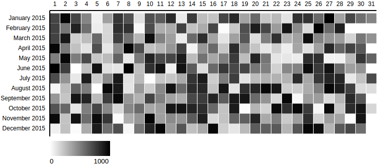
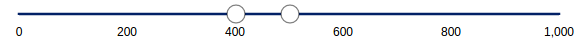
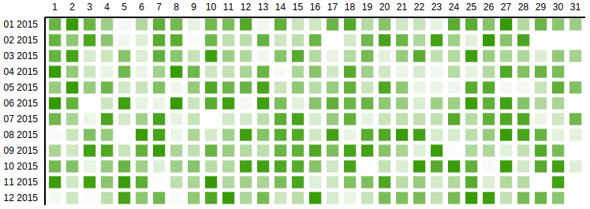

# D3 Object Charts

[](https://travis-ci.org/arbolista-dev/d3-object-charts)

This is a collection of unconventional D3 charts that aren't typically included in D3 graphing libraries such as [C3](http://c3js.org/), available as ES6 classes.

D3 visualization components implemented as objects. Available charts:
* Calendar grid chart
* Range slider - slider with two handles and configurable min/max's between the handles.
* Simple slider - slider with single handle that slides continuously.
* Snap slider - slider with one handle that will snap to values provided as labels.
* Comparative pie - Nest a standard pie chart within another circle, whose circumference intersects at bottom left corner of graph.
* Overlap bar - Similar to a stacked bar chart, but bars all start at 0, so you can style some bars to be transparent and provide an overlapped comparative view.

The easiest way get a feel for these charts is to checkout the examples.
- See them in action [here](https://rawgit.com/arbolista-dev/d3-object-charts/69aa25b126fdbca3b5caa60f9101ba291c571c59/docs/examples/index.html).
- Checkout intialization in [example entry.js](https://github.com/arbolista-dev/d3-object-charts/blob/master/docs/examples/entry.js).
- CSS plays a big role in the utility of some of these graphs [example style.css](https://github.com/arbolista-dev/d3-object-charts/blob/master/docs/examples/style.css).

## Installing

Make sure the following packages are installed on your machine
* node.js
* npm

### Install dependencies

```
$ npm install
```

### Minified production build

Compile into a minified bundle with external stylesheets.
```
$ gulp build
```

## Usage

After the installation of the dependencies the required chart can be instantiated in [src/main.js](src/main.js).

Upon completion it has to be compiled using:
```
$ gulp build
```

The compiled JS and CSS files can now be referenced to from within an HTML file.
```
// Minified stylesheets
<link href="dist/style.min.css" rel="stylesheet" type="text/css">

// Minified bundle containing D3 and chart implementation
<script charset="utf-8" src="dist/bundle.js"></script>
```

## API reference

### Calendar grid chart
Grid chart showing one month per row. Displays the y values in different opacities of a color tone. Higher values equal a darker color.



This example depicts a calendar grid chart created with the required options [using this example data set](docs/datasets/calendar_grid_example_1.js).

```js
var calendar = new CalendarGridChart({
  container: '#container-calendar',
});
calendar.drawData({
  values: data
});

```

#### Options: object instantiation

The following list shows all available options that can be passed to the CalendarGridChart object during the instantiation.

```js
var calendar = new CalendarGridChart({
  container: '#container-calendar',
  // optional properties:
  date_attr: 'date',
  // ...
});

```
Properties marked in `this format` are required.


| property | description |
| -------- | ----------- |
| `container`  | The selector representing the parent element in which the SVG will be created.  |
| *date_attr*  | The identifier for the x scale property within the data objects. Defaults to 'date'. |
| *range_attr*  | The identifier for the x scale property within the data objects. Defaults to 'date'. |
| *outer_width*  | The initial width of the SVG that contains the chart. Defaults to 800px. |
| *outer_height* | The initial height of the SVG that contains the chart. Defaults to 360px. |
| *margin* | The margin defines the space of the four sides surrounding the chart. Defaults to *{top: 30, left: 150, bottom: 30, right: 0}* |
| *color_min* | The brightest color rendered for the lowest value of the range. Defaults to #fff |
| *color_max* | The darkest color rendered for the highest value of the range. Defaults to #000 |
| *grid_padding* | The amount of space in the range interval to be allocated to padding. Typically in the range [0,1]. Defaults to 0.05. |
| *display_date_format* | The format of the Y axis ticks. Defaults to %B %Y (Month Year). |
| *min_range_zero* | Sets the minimum value of the range to 0. Defaults to false. |
| *legend* | Shows a legend with the color range that is used from the minimum value to the maximum value. Defaults to true. |

#### Options: drawData method call

The following list shows all available options that can be passed to the drawData method call.

```js
// previously created variable is referenced
calendar.drawData({
  css_class: "production-value",
  // optional property:
  values: data
});

```
Properties marked in `this format` are required.

| property | description |
| -------- | ----------- |
| `values`  | The array containing the data for the chart. Can refer to a variable or the objects can be inserted inline. |
| *css_class* | The CSS class identifying each *rect* element in the data set. Defaults to *none*. |


### Range slider

Slider to update the data range (integer or date) dynamically. The range selection (minimum and maximum) is instantly provided as an output.



This example depicts a range slider created with the required options.

```js
var range_slider = new RangeSlider({
  container: '#range-slider-int',
  outer_height: 100,
  delta: {
    'min': 50,
    'max': 100
  },
  onRangeUpdated: function(min, max) {
    console.log('min', min);
    console.log('max', max);
  }
});
range_slider.drawData({
  abs_min: 0,
  abs_max: 1000,
  current_min: 100,
  current_max: 200,
});

```

#### Options: object instantiation

The following list shows all available options that can be passed to the RangeSlider object during the instantiation.

```js
var range_slider = new RangeSlider({
  container: '#range-slider',
  delta: {
    'min': 50,
    'max': 100
  },
  onRangeUpdated: function(min, max) {
    // specify what to do with output range
  }
});

```
Properties marked in `this format` are required.


| property | description |
| -------- | ----------- |
| `container`  | The selector representing the parent element in which the SVG will be created.  |
| `delta`  | The minimum and maximum value defining the range selection spectrum. Has to be given as an object in format as follows. *delta: { 'min': 50, 'max': 100 }  |
| `onRangeUpdated`  | The selection of a range using the slider triggers this event. Hands over the current minimum and maximum value. Must be a function. Example definition: *onRangeUpdated: function(min, max) {}*  |
| *date_range*  | The indicator for whether the input data is given as a Date object or integer. Defaults to boolean *false*. |
| *tick_amount*  | The amount of ticks that should be displayed on the x axis. The specified count is only a hint; the scale may return more or fewer values depending on the input domain. Defaults to *6*. |
| *outer_width*  | The initial width of the SVG that contains the chart. Defaults to 600px. |
| *outer_height* | The initial height of the SVG that contains the chart. Defaults to 100px. |
| *margin* | The margin defines the space of the four sides surrounding the chart. Defaults to *{top: 20, left: 30, bottom: 20, right: 30}* |

#### Options: drawData method call

The following list shows all available options that can be passed to the drawData method call.

```js
// previously created variable is referenced
range_slider.drawData({
  abs_min: 0,
  abs_max: 1000,
  current_min: 100,
  current_max: 200,
});

```
Properties marked in `this format` are required.

| property | description |
| -------- | ----------- |
| `abs_min`  | The absolute minium value of the domain. Specifies the start of the x axis. |
| `abs_max`  |  The absolute maximum value of the domain. Specifies the end of the x axis. |
| `current_min`  | The minimum value of the initial range selection. Specifies the position of the left handle bar. |
| `current_max`  | The maximum value of the initial range selection. Specifies the position of the right handle bar. |

## Examples

### Calendar grid chart

This example depicts a calendar grid chart created with additional non-default options and [this example data set.](docs/datasets/calendar_grid_example_2.js)


```js
var calendar1 = new CalendarGridChart({
  container: '#container-calendar1',
  date_attr: 'day_date',
  range_attr: 'production',
  outer_width: 800,
  outer_height: 400,
  color_max: '#0404B4'
});

calendar1.drawData({
  css_class: "prod-value",
  values: data1
});

```

---

This example depicts a calendar grid chart created with additional non-default options and [this example data set.](docs/datasets/calendar_grid_example_3.js)



```js
var calendar2 = new CalendarGridChart({
  container: '#container-calendar2',
  grid_padding: 0.3,
  margin: {
    top: 50,
    left: 115,
    bottom: 50,
    right: 0
  },
  display_date_format: '%m %Y',
  date_attr: 'date',
  min_range_zero: true,
  range_attr: 'value',
  color_max: '#339900',
  legend: false
});

calendar2.drawData({
  css_class: "value",
  values: data2
});

```

### Range slider

This example depicts a range slider created with additional non-default options.


```js
var range_slider = new RangeSlider({
  container: '#range-slider',
  delta: {
    'min': 3600 * 24 * 1 * 1000,
    'max': 3600 * 24 * 5 * 1000
  },
  date_range: true,
  onRangeUpdated: function(min, max) {
    console.log('min', min);
    console.log('max', max);
  }
});

range_slider.drawData({
  abs_min: new Date(new Date() - 3600 * 24 * 30 * 1000), // 30 days ago
  abs_max: new Date(),
  current_min: new Date(new Date() - 3600 * 24 * 10 * 1000),
  current_max: new Date(new Date() - 3600 * 24 * 6 * 1000)
});

```

---

This example depicts a calendar grid chart created with additional non-default options.


```js
var range_slider_int = new RangeSlider({
  container: '#range-slider-int',
  delta: {
    'min': 10,
    'max': 20
  },
  tick_amount: 4,
  onRangeUpdated: function(min, max) {
    console.log('min', min);
    console.log('max', max);
  }
});

range_slider_int.drawData({
  abs_min: 10,
  abs_max: 99,
  current_min: 40,
  current_max: 50,
});


```
### Simple Slider

You can pass a `background_drag` boolean to move the handle position by clicking on any part of the x axis. This feature is disabled by default.

```js
var simple_slider = new SimpleSlider({
  container: '#simple-slider',
  tick_labels: {
    0: '0%',
    10: '10%',
    20: '20%',
    30: '30%',
    40: '40%',
    50: '50%',
    60: '60%',
    70: '70%',
    80: '80%',
    90: '90%',
    100: '100%'
  },
  background_drag: true,
  onChange: function(new_value) {
    console.log('new_value', new_value);
  }
});

simple_slider.drawData({
  abs_min: 0,
  abs_max: 100,
  current_value: 30
});

```


### Snap Slider

Snap slider is a simple slider that will snap a D3 brush to the nearest tick mark.

You can pass in a `snap_debounce` time in ms, to make the handler more or less smooth.

The `onSnap` call back is triggered anytime the handle is snapped to a tick mark.

```js
var snap_slider = new SnapSlider({
  container: '#snap-slider',
  tick_labels: {
    0: '0%',
    10: '10%',
    20: '20%',
    30: '30%',
    40: '40%',
    50: '50%',
    60: '60%',
    70: '70%',
    80: '80%',
    90: '90%',
    100: '100%'
  },
  snap_debounce: 100,
  onSnap: function(snap_value) {
    console.log('snap_value', snap_value);
  }
});

snap_slider.drawData({
  abs_min: 0,
  abs_max: 100,
  current_value: 30
});

```

## Developing

### Build development files
Compile into a un-minified bundle.
```
$ gulp dev
```

### Watch mode

Recompile after detected file change.
```
$ gulp watch
```

### Run Jasmine spec tests

```
$ gulp test
```
